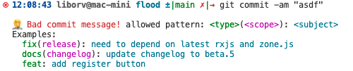

<!-- PROJECT LOGO -->
 

  <h3 align="center">conventional-commits</h3>

  

    Tools for better code.
     
    <a href="https://github.com/lipelix/conventional-commits/issues">Report Bug</a>
    ·
    <a href="https://github.com/lipelix/conventional-commits/issues">Request Feature</a>
  

<!-- ABOUT THE PROJECT -->
## About The Project

This project provides low level tools, to improve your code style.

 

(<a href="#top">back to top</a>)

<!-- GETTING STARTED -->
## Getting Started

Let's see how to use hooks. 

### Prequisities

* git

### Usage

1. Copy `commit-msg` to `.git/hooks` folder in your project
2. That's it, now you try to commit something

If your commit message doesn't meet requirements, error message will be shown and no commit is made.

(<a href="#top">back to top</a>)

<!-- ROADMAP -->
## Roadmap

- [x] Create commit-msg hook
- [ ] Create pre-push hook
- [ ] Create server side check

(<a href="#top">back to top</a>)

<!-- CONTACT -->
## Contact

Libor Váchal - [LinkedIn](https://www.linkedin.com/in/liborvachal/)

Project Link: [https://github.com/lipelix/conventional-commits](https://github.com/lipelix/conventional-commits)

(<a href="#top">back to top</a>)

<!-- ACKNOWLEDGMENTS -->
## Acknowledgments

Usefull links and another things worth to mention.

* [Conventional Commits](https://www.conventionalcommits.org/en/v1.0.0/)

(<a href="#top">back to top</a>)

